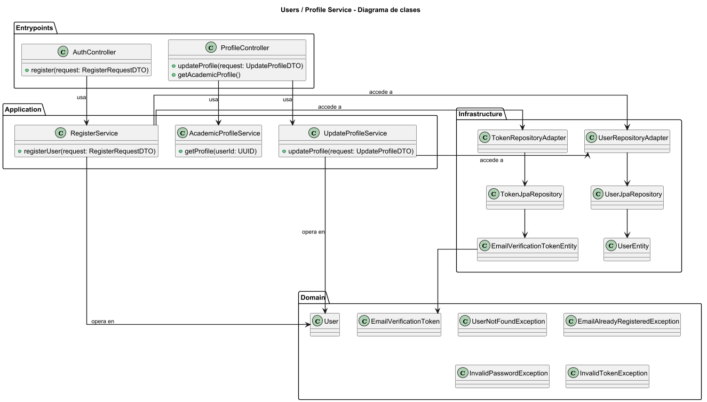
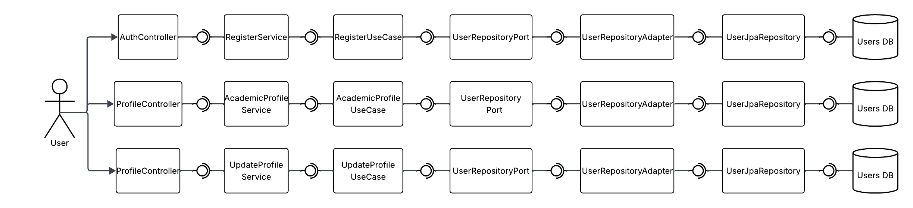

<div align="center">

# 👤 AIBERT — Profile Service

### *"Gestión centralizada del perfil del usuario dentro de la plataforma AIBERT"*

---

### 🛠️ Stack Tecnológico


### ☁️ Infraestructura & Calidad


### 🏗️ Arquitectura


</div>

---

## 📑 Tabla de Contenidos

1. [👤 Integrantes](#1--integrantes)
2. [🎯 Objetivo del Microservicio](#2--objetivo-del-microservicio)
3. [⚡ Funcionalidades Principales](#3--funcionalidades-principales)
4. [📋 Estrategia de Versionamiento y Branches](#4--manejo-de-estrategia-de-versionamiento-y-branches)
5. [⚙️ Tecnologías Utilizadas](#5--tecnologias-utilizadas)
6. [🧩 Funcionalidad](#6--funcionalidad)
7. [📊 Diagramas](#7--diagramas)
8. [⚠️ Manejo de Errores](#8--manejo-de-errores)
9. [🧪 Evidencia de Pruebas y Ejecución](#9--evidencia-de-las-pruebas-y-como-ejecutarlas)
10. [🗂️ Organización del Código](#10--codigo-de-la-implementacion-organizado-en-las-respectivas-carpetas)
11. [🚀 Ejecución del Proyecto](#11--ejecucion-del-proyecto)
12. [☁️ CI/CD y Despliegue en Azure](#12--evidencia-de-cicd-y-despliegue-en-azure)
13. [🤝 Contribuciones](#13--contribuciones)

---

## 1. 👤 Integrantes

- **Equipo:** Grootyology

---

## 2. 🎯 Objetivo del microservicio

El **Profile Service** tiene como objetivo gestionar la información asociada al usuario dentro de la plataforma AIBERT. Este microservicio es responsable del **registro de nuevos usuarios**, así como de la **consulta y actualización del perfil personal y académico**.

Actúa como la fuente única de verdad de los datos del usuario, manteniendo desacoplada esta responsabilidad del proceso de autenticación, el cual es gestionado por el Authentication Service.

---

## 3. ⚡ Funcionalidades principales

<div align="center">

<table>
  <thead>
    <tr>
      <th>🧩 Funcionalidad</th>
      <th>Descripción</th>
    </tr>
  </thead>
  <tbody>
    <tr>
      <td><strong>Registro de Usuario</strong></td>
      <td>Permite crear un nuevo usuario en el sistema y almacenar su información básica.</td>
    </tr>
    <tr>
      <td><strong>Gestión de Perfil Personal</strong></td>
      <td>Consulta y actualización de datos personales del usuario.</td>
    </tr>
    <tr>
      <td><strong>Gestión de Perfil Académico</strong></td>
      <td>Registro y modificación de información académica relevante para el sistema.</td>
    </tr>
  </tbody>
</table>

</div>

---

## 4. 📋 Manejo de Estrategia de versionamiento y branches

Para el desarrollo del **Profile Service** se utiliza una estrategia de control de versiones basada en **Git Flow**, la cual permite organizar el trabajo del equipo y mantener una separación clara entre el desarrollo de nuevas funcionalidades y las versiones estables del microservicio.

Esta estrategia ha sido clave para gestionar cambios relacionados con el registro de usuarios, la administración del perfil personal y académico, así como tareas técnicas de infraestructura y automatización.

### Estrategia de Ramas (Git Flow)

El repositorio maneja principalmente las siguientes ramas:

- `main`
- `develop`
- `feature/*`

El trabajo diario se ha concentrado en ramas de tipo `feature/*`, las cuales permiten aislar funcionalidades específicas y reducir conflictos durante la integración.

### Ramas y propósito

#### `main`
- Contiene la versión estable del **Profile Service**.
- Se utiliza como referencia para despliegues y demostraciones.
- No se realizan desarrollos directos sobre esta rama.
- Los cambios llegan a `main` únicamente después de haber sido integrados y validados en `develop`.

#### `develop`
- Rama utilizada para integrar las funcionalidades en desarrollo.
- Sirve como base para crear nuevas ramas `feature/*`.
- Permite validar la correcta integración de cambios relacionados con el manejo del perfil antes de considerarlos estables.

#### `feature/*`
- Ramas destinadas al desarrollo de funcionalidades específicas y tareas técnicas.
- Se crean a partir de `develop` y se integran nuevamente mediante Pull Requests.
- Ejemplos de ramas utilizadas en este microservicio:
    - `feature/dockerizacion`: contenedorización del Profile Service mediante Docker.
    - `feature/nuevos-requerimientos`: ajustes funcionales derivados de cambios en los requerimientos.
    - `feature/profile-ci-cd`: configuración del pipeline de integración continua.

Este enfoque permitió desarrollar cada cambio de forma aislada, facilitando su revisión e integración.

### Flujo de trabajo general

1. Se crea una rama `feature/*` a partir de `develop`.
2. Se implementan los cambios asociados a una funcionalidad o tarea específica.
3. Se validan los cambios de forma local.
4. Se genera un Pull Request hacia `develop`.
5. Una vez consolidadas las funcionalidades, `develop` se integra en `main` para actualizar la versión estable.

Esta estrategia ha permitido mantener un flujo de desarrollo ordenado, claro y consistente a lo largo del desarrollo del **Profile Service**.

---

## 5. ⚙️ Tecnologías Utilizadas

| Tecnología | Uso principal |
|----------|---------------|
| **Java 21** | Lenguaje base del microservicio |
| **Spring Boot** | Framework principal para la exposición de APIs REST |
| **Spring Data JPA** | Acceso y persistencia de datos |
| **PostgreSQL** | Base de datos relacional |
| **Maven** | Gestión de dependencias |
| **Docker** | Contenerización |
| **GitHub Actions** | Integración continua |

---

## 6. 🧩 Funcionalidad

### 📝 Registro de Usuario

Permite crear un nuevo usuario dentro del sistema AIBERT a partir de la información suministrada. Este proceso corresponde únicamente a la **gestión de datos del usuario**, mientras que la autenticación posterior es responsabilidad del Authentication Service.

**Endpoint principal:**  
`POST /api/users/register`

---

### 📦 Estructura de la Solicitud (Request)

<div align="center">

| 🏷️ Campo | 🗃️ Tipo | ⚠️ Restricción | 📝 Descripción |
|--------|--------|:-------------:|---------------|
| email | String | Obligatorio | Correo electrónico del usuario |
| password | String | Obligatorio | Contraseña inicial del usuario |
| fullName | String | Obligatorio | Nombre completo del usuario |

</div>

---

### 📦 Estructura de la Respuesta (Response)

<div align="center">

| 🏷️ Campo | 🗃️ Tipo | 📝 Descripción |
|--------|--------|---------------|
| userId | UUID | Identificador único del usuario creado |
| message | String | Confirmación del registro exitoso |

</div>

---

### 👤 Gestión de Perfil Personal

Permite consultar y actualizar la información personal del usuario autenticado, como nombre u otros datos asociados al perfil.

**Endpoints principales:**
- `GET /api/users/profile`
- `PUT /api/users/profile`

Estos endpoints permiten recuperar y modificar la información personal persistida del usuario, garantizando que solo el propietario del perfil pueda realizar cambios.

---

### 📦 Estructura de Actualización de Perfil (Request)

<div align="center">

| 🏷️ Campo | 🗃️ Tipo | ⚠️ Restricción | 📝 Descripción |
|--------|--------|:-------------:|---------------|
| fullName | String | Opcional | Nombre completo actualizado |
| avatarUrl | String | Opcional | URL de la imagen de perfil |

</div>

---

### 🎓 Gestión de Perfil Académico

Permite registrar y actualizar la información académica del usuario, la cual es utilizada por otros microservicios como Recomendaciones y Gamificación.

**Endpoint principal:**  
`PUT /api/users/profile/academic`

---

### 📦 Estructura del Perfil Académico (Request)

<div align="center">

| 🏷️ Campo | 🗃️ Tipo | ⚠️ Restricción | 📝 Descripción |
|--------|--------|:-------------:|---------------|
| program | String | Obligatorio | Programa académico |
| semester | Integer | Obligatorio | Semestre actual |
| workload | Integer | Opcional | Carga académica estimada |

</div>

---

## 7. 📊 Diagramas


---

### 🧱 Diagrama de Clases — Profile Service

El diagrama de clases representa la organización interna del microservicio y las principales entidades involucradas en la gestión del perfil del usuario.

En él se observa cómo los controladores delegan las operaciones de registro y actualización del perfil a los casos de uso correspondientes, el manejo de DTOs de entrada y salida, las entidades de dominio relacionadas con el usuario y las excepciones asociadas a las reglas de negocio del servicio.

<div align="center">



</div>

---

### 🧩 Diagrama de Componentes — Profile Service

El diagrama de componentes muestra la interacción entre los distintos componentes del microservicio durante las operaciones de registro y gestión del perfil.

El flujo evidencia la separación de responsabilidades entre:
- Controladores de entrada
- Servicios de aplicación y casos de uso
- Puertos de acceso a persistencia
- Adaptadores encargados de la comunicación con la base de datos

<div align="center">



</div>

---

### 🔁 Diagrama de Secuencia — Registro de Usuario

Este diagrama de secuencia describe el flujo completo del proceso de **registro de un nuevo usuario**. El proceso inicia cuando el cliente envía la información de registro al controlador correspondiente, el cual delega la operación al caso de uso encargado de crear el usuario.

El flujo incluye la validación de datos, la persistencia del usuario en la base de datos y la generación de la respuesta que confirma el registro exitoso.

<div align="center">


</div>

---

### 🔁 Diagrama de Secuencia — Actualización de Perfil Personal

El siguiente diagrama muestra el flujo de **actualización de la información personal del usuario**, incluyendo la validación del usuario autenticado y la persistencia de los datos actualizados.

Este flujo garantiza que únicamente el propietario del perfil pueda modificar su información personal dentro del sistema.

<div align="center">


</div>

---

### 🔁 Diagrama de Secuencia — Actualización de Perfil Académico

Este diagrama de secuencia representa el proceso de **actualización de la información académica del usuario**, utilizada posteriormente por otros microservicios como Recomendaciones y Gamificación.

El flujo describe la recepción de la solicitud, la validación de los datos académicos y la persistencia de la información actualizada.

<div align="center">


</div>

---

## 8. ⚠️ Manejo de Errores

El **Profile Service** implementa un mecanismo centralizado de manejo de errores con el objetivo de garantizar respuestas claras, consistentes y seguras ante los distintos escenarios que pueden ocurrir durante la gestión de la información del usuario.

Mediante un **manejador global de excepciones** (`@ControllerAdvice`), el servicio intercepta errores tanto de validación como del dominio de negocio, evitando exponer detalles internos del sistema y manteniendo un formato de respuesta uniforme para el cliente.

Este enfoque permite que el frontend y los demás microservicios puedan manejar los errores de forma predecible y desacoplada de la implementación interna del servicio.

---

### 📊 Tipos de errores manejados

<div align="center">

| 🔢 Código HTTP | ⚠️ Escenario |
|:-------------:|:------------|
| **400 Bad Request** | Datos inválidos en la petición, campos obligatorios faltantes o formatos incorrectos durante el registro o actualización del perfil. |
| **404 Not Found** | Usuario no encontrado al intentar consultar o actualizar información del perfil. |
| **409 Conflict** | Conflictos durante el registro de un nuevo usuario, como intentos de crear un usuario con información ya existente. |
| **500 Internal Server Error** | Error inesperado en el servidor durante operaciones de registro o actualización del perfil. |

</div>

---

Cuando ocurre un error, el servicio retorna únicamente la información necesaria para que el cliente pueda tomar acciones correctivas, sin revelar información sensible o detalles técnicos internos, reforzando así las buenas prácticas de seguridad y manejo de excepciones dentro de la plataforma **AIBERT**.

---

## 9. 🧪 Evidencia de Pruebas y Ejecución

El microservicio cuenta con **pruebas unitarias** sobre los casos de uso principales.


### 🚀 Cómo ejecutar las pruebas

#### 1️⃣ Ejecutar todas las pruebas unitarias

El siguiente comando ejecuta todas las pruebas del microservicio:

```bash
mvn clean test
```

---

## 10. 🗂️ Organización del Código (Scaffolding)

El microservicio sigue una arquitectura hexagonal (puertos y adaptadores):

```
profile-service/
│
├── 📁 src/
│   ├── 📁 main/
│   │   ├── 📁 java/com/aibert/dosw/
│   │   │   ├── 📁 application/                     # 🔵 CAPA DE APLICACIÓN
│   │   │   │   ├── 📁 dto/
│   │   │   │   │   ├── 📁 request/                 # DTOs de entrada (Register, UpdateProfile, AcademicProfile)
│   │   │   │   │   └── 📁 response/                # DTOs de salida asociados al perfil
│   │   │   │   └── 📁 service/                     # Lógica de aplicación del perfil
│   │   │   │
│   │   │   ├── 📁 config/                          # ⚙️ CONFIGURACIONES
│   │   │   │                                   # Configuración de seguridad y beans necesarios
│   │   │   │
│   │   │   ├── 📁 domain/                          # 🟢 CAPA DE DOMINIO
│   │   │   │   ├── 📁 exceptions/                  # Excepciones del dominio del perfil
│   │   │   │   ├── 📁 model/user/                  # Entidad User y modelos asociados al perfil
│   │   │   │   └── 📁 ports/                       # Puertos In / Out
│   │   │   │       ├── 📁 in/                      # Casos de uso
│   │   │   │       └── 📁 out/                     # Persistencia
│   │   │   │
│   │   │   ├── 📁 entrypoints/                     # 🔴 CAPA DE ENTRADA
│   │   │   │   ├── 📁 restcontroller/              # Controladores REST del perfil
│   │   │   │   └── 📁 advice/                      # Manejo global de errores
│   │   │   │
│   │   │   ├── 📁 infrastructure/                  # 🟠 CAPA DE INFRAESTRUCTURA
│   │   │   │   ├── 📁 adapters/
│   │   │   │   │   └── 📁 adapter/                 # Implementaciones de los puertos
│   │   │   │   └── 📁 persistence/
│   │   │   │       ├── 📁 entity/                  # Entidades JPA
│   │   │   │       ├── 📁 mapper/                  # Mapeadores dominio ↔ persistencia
│   │   │   │       └── 📁 repository/              # Repositorios JPA
│   │   │   │
│   │   │   ├── 📁 external.email                  # Integración con servicios externos (correo)
│   │   │   │
│   │   │   └── ProfileServiceApplication        # Punto de arranque Spring Boot
│   │   │
│   │   └── 📁 resources/                           # application.yml
│   │
│   └── 📁 test/                                    # 🧪 PRUEBAS UNITARIAS
│
└── pom.xml                                         # Configuración Maven
```

---

## 11. 🚀 Ejecución del Proyecto

### 📋 Prerrequisitos
- **Java 21**
- **Maven 3.8+**
- **Docker** (Opcional)

### 🛠️ Opción 1: Ejecución Local (Maven)

```bash
mvn spring-boot:run
```
📍 **URL Local:** `http://localhost:8080` (o el puerto configurado)  
📚 **Documentación API (Swagger):** `http://localhost:8080/swagger-ui.html`

### 🐳 Opción 2: Ejecución con Docker (Si se incluye Dockerfile)

```bash
docker-compose up --build -d
```

---

## 12. ☁️ CI/CD y Despliegue en Azure

El proyecto tiene capacidad para desplegarse mediante GitHub Actions hacia Azure App Service o un entorno contenedorizado en la nube.
Se definen perfiles como `dev` y `prod` en `application.yml` para gestionar la cadena de conexión de MongoDB y las keys de Gemini/Groq.

---

## 13. 🤝 Contribuciones

### Metodología
Se utiliza **Scrum** con iteraciones cortas, asegurando entregas continuas y mejora de valor. Las ramas principales son protegidas y todos los PRs deben cumplir validación estática (SonarQube) y ejecutar pipelines de CI.

<div align="center">

### 🏆 Proyecto AIBERT


</div>